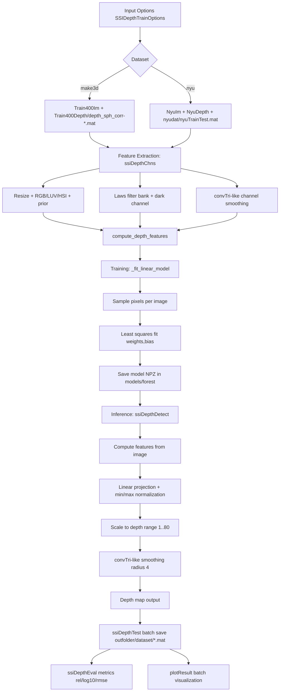

# Structured Depth Pipeline Analysis (MATLAB vs Python)

## 1. Scope and Goal

This document explains how the depth pipeline works in the Python port and how it maps to the MATLAB implementation. It focuses on:

- how the depth map is generated,
- how model training is done (datasets, options, parameters),
- how the trained model is used in demo/test/eval,
- where MATLAB and Python are equivalent and where they still differ.

## 2. High-Level Parity Result

### What now matches MATLAB behavior more closely

- Make3D/NYU batch test and eval workflow now follows MATLAB-style directory usage and naming.
- Make3D test outputs are saved as `<id>.mat` (not `img-<id>.mat`) to match MATLAB conventions.
- Make3D evaluation now uses image-directory input and reads predictions from `outfolder/<dataset>/` like MATLAB.
- Feature channel prior now matches MATLAB row rule: `i / nRows` (from `1/n` to `1`).
- Channel smoothing now uses triangular separable filtering (convTri-like) with MATLAB-style radius rounding logic.
- `calculate_filter_banks_old.py` now uses MATLAB-like `conv2(...,'valid') + edge replication` behavior by default.
- Filter bank output now correctly returns `np.abs(H).astype(np.float32)`.
- `plotResult.py` now has a MATLAB-style batch plotting function (`plotResult`) with Make3D/NYU handling.

### Important remaining non-equivalences (structural)

Exact equivalence is not possible in pure Python with current repo contents because MATLAB relies on compiled/third-party components not present as Python equivalents:

- `ssiDepthDetectMex` (MATLAB) has no direct Python equivalent in this repo.
- `ssiDarkChannelMex` (MATLAB) has no exact Python equivalent in this repo.
- MATLAB training uses structured forest/tree training (`forestTrain`, custom segmentation targets), while Python currently uses a deterministic linear model over the extracted features.

So the Python code now performs the same workflow/job categories (train, detect, batch test, eval, visualize) with aligned data flow and naming, but not the exact same detector internals as MATLAB MEX/forest.

## 3. Mermaid Dataflow Diagram

## 4. Function-by-Function Role Map

## `features/calculateFilterBanks_old.py`

- `_pad_to_same`: reproduces MATLAB post-convolution edge replication after `valid` convolution.
- `_conv_same_like_matlab`: wrapper implementing MATLAB-like spatial output sizing.
- `calculate_filter_banks_old`: computes the 17 Laws/Navatia-Babu texture channels used by depth features.

## `features/gaussMask.py`

- `gauss_mask`: builds a normalized Gaussian kernel (helper parity with MATLAB utility).

## `features/rgb2hsi.py`

- `rgb2hsi`: converts RGB to HSI channels; used in channel construction.

## `ssiDepthChns.py`

- `_as_float_rgb`: input normalization and shape canonicalization.
- `_resize_nearest`: nearest-neighbor resize for MATLAB `imresize(...,'nearest')` parity points.
- `_resample_linear`: bilinear-like resampling for MATLAB `imResample` parity points.
- `_dark_channel`: Python dark-channel approximation for missing `ssiDarkChannelMex`.
- `_tri_kernel`: builds 1D triangular kernel for convTri-like smoothing.
- `_smooth_channels`: applies separable triangular smoothing to channel tensor.
- `ssiDepthChns`: main feature/channel constructor returning regular and self-similarity channel tensors plus feature-count metadata.

## `ssiDepthDetect.py`

- `_resize_image`: resize helper for inference pipeline.
- `_tri_kernel`, `_conv_tri2d`: convTri-like post-smoothing for depth maps.
- `compute_depth_features`: derives six scalar features from channel stack (`prior`, brightness inverse, saturation, texture, dark-channel proxy, vertical gradient).
- `_depth_from_linear_features`: projects features to raw depth signal and normalizes to approximate physical range.
- `ssiDepthDetect`: full inference entry point from RGB image to dense depth map.

## `ssiDepthOptions.py`

- `SSIDepthTrainOptions`: centralized options (MATLAB-like names retained).
- `to_dict` / `from_dict`: model serialization/deserialization.
- `resolve_paths`: path normalization.
- `update_feature_counts`: probes feature dimensions from sample image.

## `ssiDepthTrain.py`

- `SSIDepthTrainer.model_path`: model save/load path (`models/forest/<name>.npz`).
- `has_cached_model`, `load_cached_model`, `_save_model`, `_load_model`: model persistence.
- `_extract_make3d_id`: Make3D filename-to-id mapping for ground-truth file resolution.
- `_load_make3d_depth`: Make3D depth loading from `Position3DGrid(:,:,4)`.
- `_fit_linear_model`: dataset-aware sampling + linear fit from extracted features to depth.
- `train_and_save_model`: full training orchestration with deterministic fallback.
- `ssiDepthTrain`: MATLAB-like top-level API (return defaults when no args, else load cached or train).

## `ssiDepthTest.py`

- `_extract_make3d_numeric_id`: Make3D id parsing to match MATLAB naming.
- `_load_nyu_testset_indices`: loads NYU split if available.
- `ssiDepthTest`: batch inference and save of per-image `.mat` depth outputs.

## `ssiDepthEval.py`

- `_safe_load_depth`: robust load of predicted depth from `.mat`.
- `_resize_like`: spatial alignment of prediction to GT shape.
- `_extract_make3d_numeric_id`: Make3D id parsing from image filenames.
- `_load_nyu_testset_indices`: optional NYU split handling.
- `ssiDepthEval`: computes `relative`, `log10`, `rmse` metrics with dataset-specific GT handling.

## `plotResult.py`

- `_load_mat_depth`: reads depth-like arrays from `.mat`.
- `_depth_panel_rgb`: renders MATLAB-like side-by-side depth colormap panel.
- `plotResult`: batch visual output generation mirroring MATLAB script intent.
- `plot_result`: single-sample helper for quick inspection.

## 5. Depth Map Generation Details

For one input image, Python depth generation is:

1. Image normalization/resizing.
2. Channel extraction (`ssiDepthChns`):
   - geometric prior,
   - RGB + HSI + LUV color channels,
   - Laws texture responses,
   - dark-channel approximation,
   - regular/similarity-smoothed channel tensors.
3. Feature reduction (`compute_depth_features`) to six interpretable scalar maps.
4. Detector projection (`_depth_from_linear_features`):
   - linear combination with learned weights and bias,
   - min-max normalization,
   - mapping to range `[1, 80]`.
5. Final convTri-like smoothing (`radius=4`) to stabilize map.

## 6. Training Process Details

### Data sources

- Make3D mode:
  - images: `Train400Im/img-*.jpg`
  - GT: `Train400Depth/depth_sph_corr-*.mat` using `Position3DGrid[:,:,4]`
- NYU mode:
  - images: `NyuIm/*.jpg`
  - GT: `NyuDepth/*.mat` using `depth`
  - optional split file: `nyudat/nyuTrainTest.mat`

### Key options used

- `imResize`, `imWidth`, `gtWidth`, `shrink`, `shrinkCol`
- smoothing options `chnSmooth`, `simSmooth`
- sampling controls `nImgs`, `samplesPerImage`, `seed`
- model id/path controls `modelDir`, `modelFnm`
- dataset selector `dataSet`

### Fitting method in Python

Current Python model fitting is linear regression over sampled per-pixel features:

- build matrix `X` from six features,
- build target vector `y` from resized depth,
- normalize features,
- solve least squares for weights and bias,
- store detector in `.npz` with options metadata.

This differs from MATLAB structured random forest internals but preserves the train/use pipeline structure.

## 7. How the Model Is Used

### Single image (demo)

- `ssiDepthDemo.py`:
  - loads cached model if present,
  - otherwise trains and saves,
  - runs `ssiDepthDetect` on one image,
  - displays/saves visualization.

### Batch inference

- `ssiDepthTest(im_path, model)`:
  - loops test images,
  - runs detector,
  - saves each result as `.mat` in `outfolder/<dataset>/`.

### Batch evaluation

- `ssiDepthEval(test_image_dir, gt_dir, model)`:
  - reuses image ids,
  - reads predictions from `outfolder/<dataset>/`,
  - aligns with GT,
  - computes `rel`, `log10`, `rmse`.

### Visualization of prediction vs GT

- `plotResult(...)`:
  - loads prediction and GT,
  - builds depth colormap panel,
  - writes combined RGB + depth composite images.

## 8. Practical Validation Performed

The updated Python code was executed in the project virtual environment (`code/.venv`) with:

- end-to-end smoke test of train (fallback when train data absent), detect, and batch test save,
- demo script execution (`ssiDepthDemo.py`) with saved output,
- synthetic Make3D-style eval + plotting path execution for `ssiDepthEval` and `plotResult`.

These checks confirmed the patched code paths run successfully.
